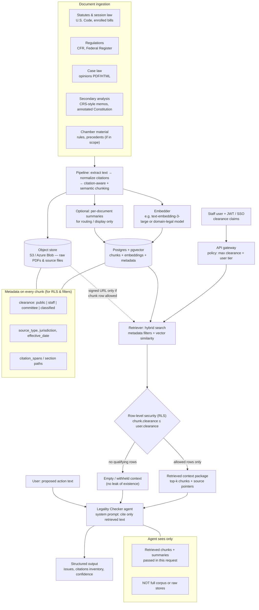

# LAB Congress — Task 2: Architecture (Legality Checker / Option A)

Mermaid diagram for the **Legality Checker** focal agent: legal corpora, hybrid retrieval, tiered access, and RAG into the structured-assessment prompt.

---

## Architecture diagram

---

## Design questions (concise)

| Question | Choice for this system |
|----------|-------------------------|
| **Ingestion & chunking** | Ingest **legislative text, statutes, regs, opinions, secondary memos** (not constituent mail as a primary source for legality). **Chunk** with **citation-aware boundaries** (sections, syllabi, paragraph breaks) plus **semantic windows**; store **optional summaries** for routing/UI, not as sole evidence for “clearly legal/illegal.” |
| **Access control** | **Database-enforced RLS** on chunk/document rows by **clearance tier**; API maps SSO/JWT to max tier. Prefer **filtering at query time** so the model never receives withheld text. |
| **Where vectors vs raw live** | **Vectors + chunk text + metadata** in **Postgres/pgvector**; **original PDFs/files** in **object storage** with **same clearance metadata**; retrieval returns chunk text; raw fetch only via **short-lived signed URLs** after RLS passes. |
| **What the agent sees** | **Only retrieved chunks (and optional short summaries of those docs)** in the prompt for that turn—not the full DB or arbitrary raw files. |
| **Query above clearance** | **RLS excludes rows**; retriever returns **empty or degraded context**; agent must answer with **legally uncertain / outside my knowledge** and **no inference** from missing data. Optionally return **403** at API for obviously mis-scoped requests without revealing labels. |

---

← [Lab handout: `LAB_congress.md`](LAB_congress.md)
