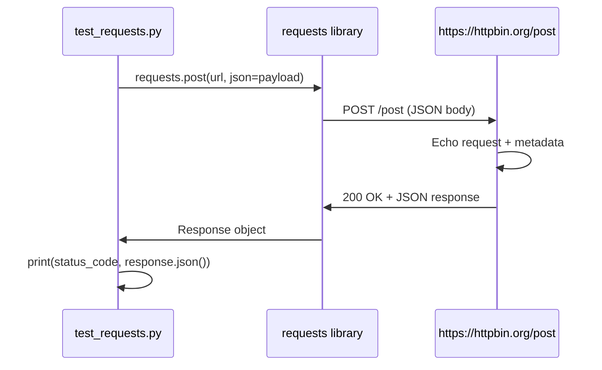

# test_requests.py — API Script Documentation

## Overview

`test_requests.py` is a small Python script that demonstrates sending a **POST** request with JSON data using the `requests` library. It calls [httpbin.org](https://httpbin.org)’s `/post` endpoint, which echoes the request back, and prints the HTTP status code and the parsed JSON response. It is useful for checking that your environment can make outbound HTTP requests and that JSON serialization/deserialization works.

---

## API Endpoint & Parameters

| Item | Value |
|------|--------|
| **Base URL** | `https://httpbin.org` |
| **Endpoint** | `/post` |
| **Method** | `POST` |
| **Request body** | JSON (see [Data structure](#data-structure) below) |

### Request

- **URL:** `https://httpbin.org/post`
- **Headers:** `Content-Type: application/json` (set automatically by `requests` when using `json=`)
- **Body:** JSON object (e.g. `{"name": "test"}`)

No query or path parameters are required; the payload is sent in the request body.

---

## Data Structure

### Request payload (sent by the script)

```json
{
  "name": "test"
}
```

| Field | Type | Description |
|-------|------|-------------|
| `name` | string | Example field; you can add more keys as needed. |

### Response (from httpbin.org/post)

httpbin echoes the request and adds metadata. A typical response body looks like:

```json
{
  "args": {},
  "data": "{\"name\": \"test\"}",
  "files": {},
  "form": {},
  "headers": {
    "Accept": "*/*",
    "Accept-Encoding": "gzip, deflate",
    "Content-Length": "16",
    "Content-Type": "application/json",
    "Host": "httpbin.org",
    ...
  },
  "json": {
    "name": "test"
  },
  "origin": "<client IP>",
  "url": "https://httpbin.org/post"
}
```

| Field | Type | Description |
|-------|------|-------------|
| `args` | object | Query string parameters (empty for this script). |
| `data` | string | Raw request body as a string. |
| `files` | object | Uploaded files (empty here). |
| `form` | object | Form data (empty here). |
| `headers` | object | Request headers as seen by httpbin. |
| `json` | object | Parsed JSON from the request body (your payload). |
| `origin` | string | Client IP address. |
| `url` | string | Full request URL. |

The script prints `response.status_code` (e.g. `200`) and `response.json()` (the object above).

---

## Flow Diagram (Mermaid)



---

## Usage Instructions

### Prerequisites

- **Python 3.6+** (for f-strings and standard library).
- **`requests`** installed:

  ```bash
  pip install requests
  ```

### How to run

1. Open a terminal in the folder containing `test_requests.py` (e.g. `02_productivity/`).
2. Run:

   ```bash
   python test_requests.py
   ```

3. You should see output similar to:

   ```
   Status: 200
   Response: {'args': {}, 'data': '{"name": "test"}', 'files': {}, ...}
   ```

### Optional: use a virtual environment

```bash
python -m venv venv
source venv/bin/activate   # On Windows: venv\Scripts\activate
pip install requests
python test_requests.py
```

### Modifying the payload

Edit the `payload` dictionary in `test_requests.py` to send different JSON:

```python
payload = {"name": "test", "id": 1, "tags": ["a", "b"]}
```

The same endpoint and usage instructions still apply; only the request/response `json` (and `data`) content will change.

---

## Related

This script supports the workflow described in **LAB_cursor_shiny_app.md**: use your API query (e.g. this script or an adapted version) as the backend logic for a Shiny app that executes the request and displays results.
