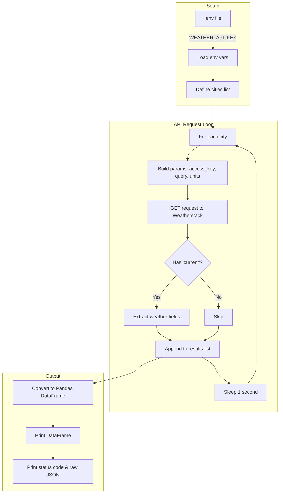

# 04_my_good_query.py — Documentation

**Author:** Joni Nguyen  
**Purpose:** Query current weather data for multiple US cities using the Weatherstack API

---

## Overview

This script demonstrates a meaningful API query that returns substantial data for building a reporter application. It:

- Loads an API key from a `.env` file
- Makes GET requests to the Weatherstack current weather API for 10 US cities
- Parses JSON responses and extracts key weather fields
- Stores results in a Pandas DataFrame for analysis
- Includes rate-limiting protection (1-second delay between requests)

The script returns **10 rows** of data (one per city) with temperature, humidity, wind speed, pressure, and weather descriptions.

---

## API Endpoint & Parameters

| Property | Value |
|----------|-------|
| **API Name** | Weatherstack |
| **Base URL** | `http://api.weatherstack.com/current` |
| **Method** | GET |

### Required Parameters

| Parameter | Type | Description |
|-----------|------|-------------|
| `access_key` | string | Your API key (loaded from `.env`) |
| `query` | string | Location name (city, state, or country) |
| `units` | string | `m` = metric (°C, km/h), `f` = Fahrenheit (°F, mph), `s` = scientific |

This script uses `units=f` for Fahrenheit and miles per hour.

---

## Data Structure

### Raw API Response (JSON)

The Weatherstack API returns JSON with this structure:

```
{
  "current": {
    "temperature": <number>,
    "humidity": <number>,
    "wind_speed": <number>,
    "pressure": <number>,
    "weather_descriptions": [<string>, ...]
  }
}
```

### Extracted Tabular Data (DataFrame)

| Column | Type | Description |
|--------|------|-------------|
| `city` | string | City name (query parameter) |
| `temperature_F` | float | Current temperature in Fahrenheit |
| `humidity` | int | Relative humidity (%) |
| `wind_mph` | float | Wind speed in miles per hour |
| `pressure` | int | Atmospheric pressure |
| `weather` | string | Textual weather description (e.g., "Partly cloudy") |

---

## Flow Diagram



---

## Usage Instructions

### Prerequisites

1. **Python 3.x** with the following packages:

   ```bash
   pip install requests python-dotenv pandas
   ```

2. **Weatherstack API key** — Get a free key at [weatherstack.com](https://weatherstack.com/).

### Setup

1. Create a `.env` file in the project root (same directory as the script or parent):

   ```
   WEATHER_API_KEY=your_api_key_here
   ```

2. Ensure `.env` is in `.gitignore` so your key is not committed.

### Running the Script

From the project root or the `01_query_api` directory:

```bash
python 04_my_good_query.py
```

Or, if using a different working directory:

```bash
python path/to/01_query_api/04_my_good_query.py
```

The script will:

1. Load `WEATHER_API_KEY` from `.env`
2. Query weather for 10 cities (New York, Los Angeles, Chicago, Houston, Phoenix, Philadelphia, Seattle, San Diego, Boston, San Jose)
3. Print a DataFrame with the aggregated results
4. Print the final HTTP status code (200 = success)
5. Print the raw JSON of the last response

### Notes

- **Rate limits:** A 1-second pause between requests reduces the chance of hitting API rate limits.
- **Error handling:** Only responses that include a `current` key are stored; invalid or failed queries are skipped.
- **Cities queried:** New York, Los Angeles, Chicago, Houston, Phoenix, Philadelphia, Seattle, San Diego, Boston, San Jose.

---

## Example Output

```
WEATHER_API_KEY = abc123...

   city  temperature_F  humidity  wind_mph  pressure        weather
0  New York         42.0        65       12     1015  Partly cloudy
1  Los Angeles      68.0        55        8     1012         Clear
...
```
