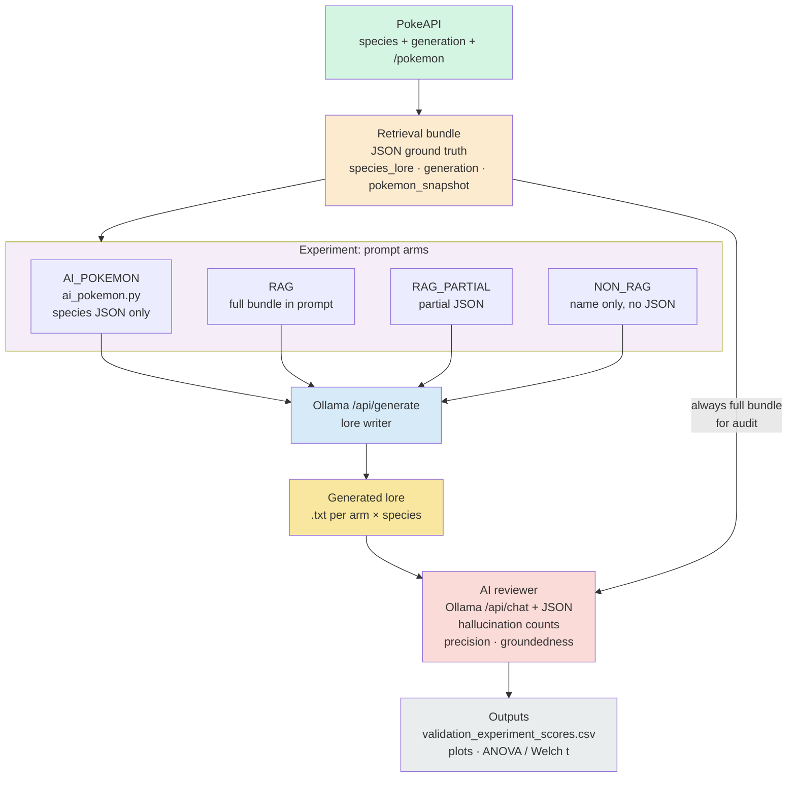

# Pokédex lore validation — system design

This diagram matches the pipeline in `ai_validator_pokemon.py`: PokeAPI data is assembled into a **retrieval bundle**, each **prompt arm** generates lore via Ollama **`/api/generate`**, then an **AI reviewer** calls Ollama **`/api/chat`** with JSON mode using the **full bundle** as ground truth. Results are saved as report text files, a scores CSV, and printed statistics.

To regenerate this file and the optional PNG, run:

- `python3 diagram_validation_system.py` — updates this Markdown
- `python3 diagram_validation_system.py --png` — also writes `validation_runs/run_default/system_design_diagram.png`
